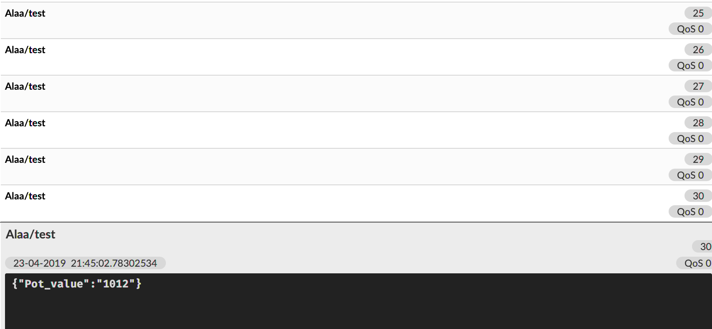
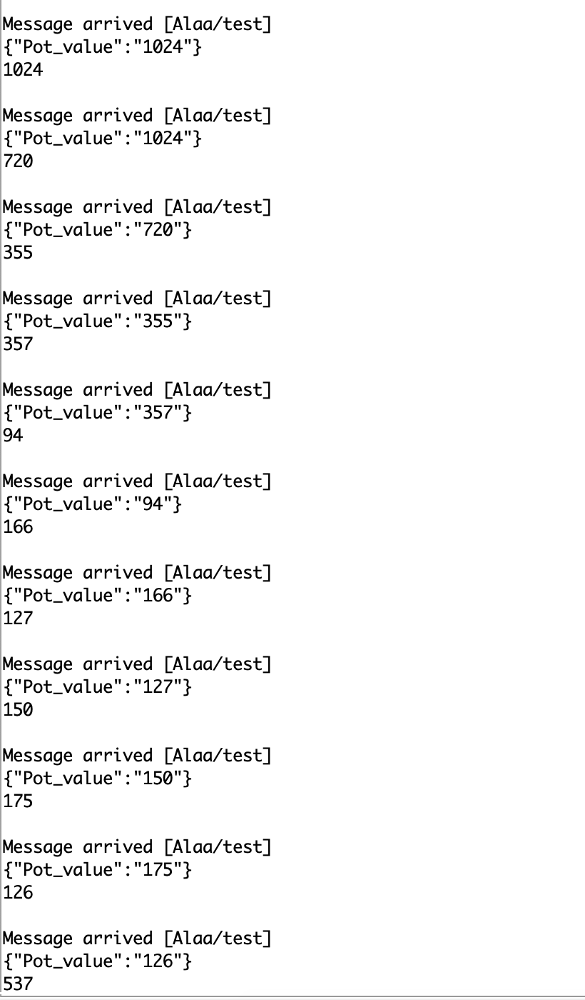

# ** MQTT   **
## PUBLISHING & SUBSCRIBING

Program for creating a topic on an MQTT server and publishing potentiometer data to it

## __Output__
If you followed all of the instructions, then your output should look a little something like this:

and the serial monitor side:

 
